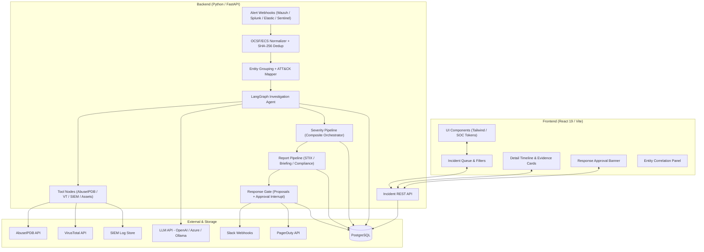
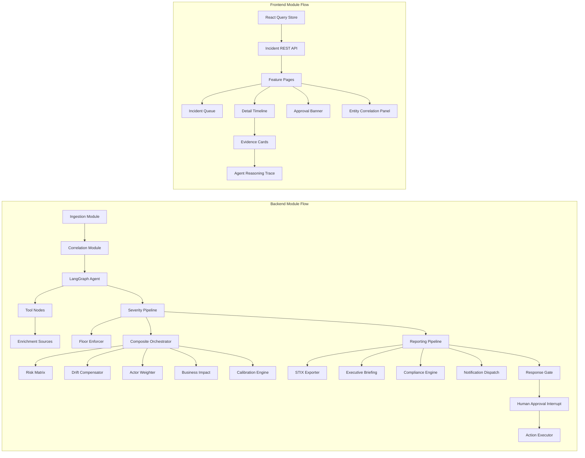

# Security Operations Agent

A production-grade, AI-augmented Security Operations platform built for enterprise SOC teams. Features a LangGraph-powered autonomous investigation agent, MITRE ATT&CK-mapped event correlation with sliding time-window entity grouping, hybrid deterministic-plus-LLM severity scoring with a tamper-proof non-downgrade floor enforcer, CVSS-inspired risk matrix scoring, environmental drift compensation for off-hours and maintenance windows, threat actor capability and sophistication weighting, business impact and SLA deadline assessment, historical analyst feedback calibration, STIX 2.1 threat intelligence bundle exports, executive briefing generation with financial impact quantification and SEC Form 8-K materiality assessment, MITRE ATT&CK kill-chain graph visualization, forensic SHA-256 chain-of-custody manifests, regulatory compliance disclosure automation (GDPR 72h, SEC Form 8-K, HIPAA), 5-Whys root cause analysis with MITRE D3FEND countermeasure mapping, multi-channel Slack Block Kit and Teams Adaptive Card dispatch, historical report diff tracking, unified multi-stage report orchestration, LangGraph server-side human-approval interrupt gates for host isolation and IP blocking, a React 19 Sentinel-inspired SOC dashboard, adversarial prompt-injection defenses, attack replay evaluation against labeled incidents, Helm/Kubernetes deployment, and a GitHub Actions evaluation quality gate.

## Features

### Core Pipeline
- **Alert Ingestion**: Wazuh webhook receiver with adapters for Splunk, Elastic, and Microsoft Sentinel -- normalized to a unified OCSF/ECS schema with SHA-256 alert deduplication preventing reprocessing of identical events across any source
- **Event Correlation**: Sliding time-window entity grouping by source/dest IP, user, and host with MITRE ATT&CK tactic and technique mapping that automatically classifies alerts into known adversary behaviors
- **LangGraph Investigation Agent**: Multi-step stateful investigation graph that autonomously queries AbuseIPDB, VirusTotal, SIEM log search, and asset criticality lookups -- wrapped behind a strict untrusted-data boundary with execution step limiters preventing runaway agent loops on adversarial inputs
- **Hybrid Severity Scoring**: Deterministic formula combined with structured LLM reasoning contributions, producing a final severity score that cannot be quietly lowered below the calculated deterministic floor without a logged, human-authorized override
- **Evidence-Linked Reporting**: Structured incident timelines with full evidence traceability, Markdown and PDF exports, forensic chain-of-custody manifests with cryptographic SHA-256 verification, and STIX 2.1 JSON bundles for automated threat intelligence sharing
- **Human-in-the-Loop Response Gate**: LangGraph server-side interrupt that halts execution at the containment decision point -- host isolation, IP blocking, and user disabling require explicit analyst sign-off before any action is executed

### Advanced Features

#### Severity Engine (Day 4)
- **Risk Matrix Scorer**: CVSS-inspired multi-factor matrix combining asset criticality tier, ATT&CK technique severity, attack complexity, and scope of impact into a normalized 0-100 severity score
- **Environmental Drift Compensator**: Dynamically adjusts severity thresholds based on temporal context -- off-hours alerts, active maintenance windows, and known high-traffic periods widen the effective severity window to reduce false negatives during high-risk periods
- **Threat Actor Weighting**: Assigns capability and sophistication multipliers to known APT groups, ransomware operators, and insider threat profiles based on MITRE ATT&CK Group intelligence, boosting scores for confirmed advanced persistent threats
- **Business Impact Assessor**: Maps affected systems to critical business workflows, calculating SLA deadline pressure, potential financial exposure, and service disruption radius to contextualize technical severity in business terms
- **Historical Calibration Engine**: Records analyst feedback (agree/disagree/override) on each scored incident and applies a continuously updated bias offset correction to reduce systematic over- or under-scoring across alert categories over time
- **Composite Orchestrator**: Unified single-entry-point that runs all five scoring dimensions in sequence, aggregates weighted outputs, applies floor enforcement, and emits a CompositeSeverityResult with full audit provenance for every contributing factor
- **Floor Enforcement**: Tamper-proof non-downgrade invariant with cryptographic audit proofs -- once the deterministic scorer assigns a severity floor, no LLM reasoning, external API signal, or runtime input can reduce the final score below it without triggering a logged FloorEnforcementRecord violation

#### Report Generation Engine (Day 5)
- **STIX 2.1 Exporter**: Generates standards-compliant STIX 2.1 JSON bundles containing Indicator, Threat Actor, Attack Pattern, Course of Action, and Relationship objects -- ready for direct ingestion by TAXII feeds and ISAC sharing platforms
- **Executive Briefing Generator**: Produces board-ready incident summaries with financial impact quantification, SEC Form 8-K materiality assessment, GDPR breach notification eligibility scoring, and recommended executive actions
- **MITRE ATT&CK Graph Visualizer**: Renders Mermaid kill-chain diagrams and ASCII attack graphs mapping the full adversary path from Initial Access through Impact -- embeddable in Markdown reports and Slack Block Kit messages
- **Forensic Chain-of-Custody**: Generates cryptographic SHA-256 verification manifests for every piece of evidence collected during the investigation, including collection timestamps, analyst IDs, and hash chains suitable for legal proceedings
- **Regulatory Compliance Engine**: Drafts GDPR 72-hour supervisory authority notifications, SEC Form 8-K incident disclosure language, and HIPAA breach notification letters -- pre-populated with incident data and flagged with applicable regulatory deadlines
- **Root Cause Analyzer**: Applies structured 5-Whys methodology to identify root contributing factors, then maps each cause to MITRE D3FEND defensive technique countermeasures with implementation guidance
- **Multi-Channel Notification Dispatcher**: Formats enriched incident alerts as Slack Block Kit messages (with severity color bars, entity tables, and inline action buttons) and Microsoft Teams Adaptive Cards -- dispatched to configured SOC channels with severity-tiered routing
- **Historical Report Diff Engine**: Tracks semantic changes between report revisions across the incident lifecycle, highlighting newly added evidence, changed severity assessments, and updated entity lists to give auditors a precise record of how understanding of an incident evolved
- **Unified Report Orchestrator**: Multi-stage pipeline that runs all reporting modules in sequence and assembles outputs into analyst dossiers, executive packages, and compliance bundles in a single pass -- STIX export through compliance disclosure through notification dispatch without manual coordination

#### Escalation & Human-in-the-Loop (Phase 6)
- **Slack & PagerDuty Dispatch**: Structured escalation webhooks with on-call routing, severity-tiered PagerDuty urgency levels, and Slack Block Kit messages with approve/reject action buttons directly inline for rapid analyst response
- **LangGraph Interrupt Gate**: Server-side execution interrupt that pauses the agent graph at the containment decision node and checkpoints state to PostgreSQL -- the agent proposes actions but cannot execute host isolation, IP blocking, user disabling, or process termination until an analyst explicitly approves via the REST API or SOC dashboard
- **Proposed Action Ledger**: Append-only, immutable audit trail recording every proposed, approved, rejected, and rolled-back containment action with analyst identity, timestamp, written justification, and execution outcome
- **Risk-Tiered Approval**: LOW-risk actions (non-disruptive enrichment queries) can be pre-approved by policy; MEDIUM actions require standard analyst confirmation; HIGH and CRITICAL actions targeting Tier-0 assets (Domain Controllers, core databases, HSMs) require senior analyst sign-off with mandatory written justification stored immutably in the ledger

### SOC Dashboard
- **Incident Queue**: Dense sortable and filterable incident table with real-time severity badges, escalation status indicators, MITRE ATT&CK tactic tags, and time-to-SLA countdown timers for active incidents
- **Detail Timeline**: Full investigation timeline view showing every agent step, tool call, evidence item, and analyst decision with expandable evidence cards and the complete LangGraph agent reasoning trace
- **Response Approval Banner**: Prominent full-width approval UI surfaced whenever containment actions are pending -- displays proposed action type, target entity, risk level, agent justification, and approve/reject controls with mandatory written justification field for HIGH and CRITICAL risk actions
- **Entity Correlation Panel**: Graph-style visualization connecting source IPs, destination hosts, user accounts, and ATT&CK techniques across all correlated alerts in an incident, with pivot-to-search on any entity node

### Security Design Invariants
- **Log content is attacker-controlled input**: Usernames, user-agent strings, process command lines, URLs, and hostnames extracted from SIEM logs can contain prompt-injection payloads crafted to manipulate the investigation agent. Every field pulled from raw log data is escaped, delimited with structural markers, and explicitly labeled as untrusted before being included in any LLM prompt context
- **The LLM cannot quietly downgrade a real threat**: False negatives -- missed attacks -- carry catastrophically higher cost than false positives. Severity is calculated deterministically from rules, asset criticality tiers, threat intelligence, and ATT&CK technique scores. The LLM may provide reasoning that raises severity or justifies an escalation, but it cannot reduce the severity score below the deterministic floor without a logged, explicitly human-authorized override that creates an immutable audit record

### Evaluation & Adversarial Testing
- **Attack Replay Evaluation**: Labeled incident dataset replayed through the full pipeline to measure detection accuracy, ATT&CK mapping precision, severity calibration, and report quality against ground-truth labels
- **Prompt Injection Defense Suite**: Systematic testing of 15+ injection patterns (role override, delimiter escape, instruction smuggling via log field content) against the untrusted-data boundary wrapper to verify the investigation agent cannot be redirected by adversarial log content
- **External API Failure Mode Testing**: Simulated outages of AbuseIPDB, VirusTotal, and SIEM log endpoints to verify graceful degradation, fallback enrichment paths, and accurate confidence score reduction when evidence sources are unavailable
- **Evaluation Quality Gate**: GitHub Actions workflow that blocks merges if the attack replay evaluation falls below the minimum detection accuracy threshold, ensuring the pipeline never regresses on known adversary techniques

## Tech Stack

### Backend
- **Python 3.11** with FastAPI for async webhook receivers, parallel threat-intel calls, and the incident REST API
- **LangGraph** for the multi-step stateful investigation graph with server-side interrupt and checkpoint model enabling human-approval gates at the containment decision point
- **Wazuh** (primary dev target) with adapters for **Splunk**, **Elastic**, and **Microsoft Sentinel** behind a unified AlertSource interface
- **PostgreSQL** for normalized alerts, correlated incidents, entity graph relationships, investigation logs, and append-only audit trails
- **AbuseIPDB** and **VirusTotal** for grounded external threat intelligence instead of relying on LLM hallucinations from alert text alone
- **GeoIP** and asset/user context APIs for environmental enrichment during the investigation phase
- **mitreattack-python** for offline MITRE ATT&CK STIX bundle lookups, tactic/technique classification, and D3FEND countermeasure mapping
- **Pydantic v2** for strict schema validation across all alert normalization, scoring, and report data models
- **OpenAI-compatible LLM API** (configurable: OpenAI, Azure OpenAI, or local Ollama endpoint) for structured reasoning contributions to severity scoring and investigation summaries
- **APScheduler** for scheduled evaluation jobs and periodic report generation tasks
- **Nodemailer-equivalent (smtplib)** for compliance disclosure email drafts
- **pytest** with 86 tests covering ingestion, correlation, severity engine (55 tests), reporting engine (31 tests), prompt injection defenses, and external API failure modes

### Frontend
- **React 19** with TypeScript
- **Vite** for fast development builds and optimized production bundles
- **React Router** for incident queue, detail, and approval page navigation
- **Tailwind CSS** with a custom high-contrast dark SOC design token system inspired by Microsoft Sentinel
- **Recharts** for incident timeline graphs, severity trend charts, and evaluation accuracy dashboards
- **React Query** for incident data fetching with automatic cache invalidation on analyst approval actions
- **Socket.io Client** for real-time incident queue updates and pending approval status synchronization

### Other
- **pytest** for backend unit and integration testing
- **pytest-asyncio** for async FastAPI route and LangGraph agent graph testing
- **Docker Compose** for local PostgreSQL and alert simulator stack
- **Helm / Kubernetes** for production deployment with bitnami PostgreSQL sub-chart
- **GitHub Actions** for CI/CD with evaluation quality gate enforcing minimum detection accuracy before any merge to main

## System Architecture



## Module Dependency



## Project Structure

```
Security Operations Agent/
+-- backend/
|   +-- app/                        # FastAPI application factory
|   |   +-- api/                    # API routers
|   |   |   +-- health.py           # Health check and readiness probe
|   |   |   +-- alerts.py           # Wazuh and multi-source alert webhook receivers
|   |   |   +-- incidents.py        # Incident query, detail, severity, and approval API
|   |   +-- core/                   # Config, settings, and environment bindings
|   +-- ingestion/                  # Alert normalization pipeline
|   |   +-- sources/                # AlertSource adapters (Wazuh, Splunk, Elastic, Sentinel)
|   |   +-- normalizer.py           # OCSF/ECS schema normalization
|   |   +-- deduplicator.py         # SHA-256 alert deduplication with persistent store
|   +-- correlation/                # Event correlation engine
|   |   +-- grouper.py              # Sliding time-window entity grouping
|   |   +-- attack_mapper.py        # MITRE ATT&CK tactic and technique classifier
|   |   +-- models.py               # CorrelatedIncident and EntityGroup data models
|   +-- agent/                      # LangGraph investigation agent
|   |   +-- graph.py                # Agent graph definition with interrupt nodes
|   |   +-- state.py                # Investigation state schema
|   |   +-- boundary.py             # Untrusted-data boundary wrapper and escape layer
|   |   +-- tools/                  # Tool node implementations
|   |       +-- abuseipdb.py        # AbuseIPDB IP reputation lookup
|   |       +-- virustotal.py       # VirusTotal file hash, URL, and IP analysis
|   |       +-- siem_search.py      # SIEM log search tool node
|   |       +-- asset_context.py    # Asset criticality and user context resolver
|   +-- severity/                   # Hybrid severity scoring pipeline
|   |   +-- scorer.py               # DeterministicScorer with score_with_composite()
|   |   +-- floor_enforcer.py       # Tamper-proof non-downgrade invariant with audit proofs
|   |   +-- risk_matrix.py          # CVSS-inspired multi-factor risk matrix scorer
|   |   +-- drift_compensator.py    # Environmental and temporal sensitivity adjuster
|   |   +-- actor_weighter.py       # Threat actor capability and sophistication weighting
|   |   +-- business_impact.py      # Business disruption and SLA impact assessor
|   |   +-- calibration.py          # Historical analyst feedback calibration engine
|   |   +-- composite_scorer.py     # Unified composite orchestrator
|   |   +-- report_generator.py     # Markdown and JSON analyst severity report generator
|   +-- reporting/                  # Evidence-linked report generation pipeline
|   |   +-- stix_exporter.py        # STIX 2.1 JSON bundle generator
|   |   +-- executive_briefing.py   # Financial impact and board-ready briefing generator
|   |   +-- attack_graph.py         # MITRE ATT&CK kill-chain Mermaid and ASCII visualizer
|   |   +-- chain_of_custody.py     # Forensic SHA-256 chain-of-custody manifest generator
|   |   +-- compliance_engine.py    # GDPR / SEC Form 8-K / HIPAA disclosure drafter
|   |   +-- root_cause_analyzer.py  # 5-Whys methodology with MITRE D3FEND countermeasures
|   |   +-- dispatch.py             # Slack Block Kit and Teams Adaptive Card dispatcher
|   |   +-- report_diff.py          # Historical report diff and revision tracker
|   |   +-- orchestrator.py         # Unified multi-stage report orchestrator
|   |   +-- models.py               # Report, briefing, and compliance data models
|   +-- response/                   # Human-in-the-loop response gate
|   |   +-- models.py               # ProposedAction, ActionType, ActionStatus, ActionRiskLevel
|   |   +-- manager.py              # Action lifecycle and approval state machine
|   |   +-- escalation.py           # Slack and PagerDuty escalation dispatcher
|   |   +-- executor.py             # Risk-tiered approved action execution client
|   +-- evaluation/                 # Evaluation and adversarial testing harness
|   |   +-- replay.py               # Attack replay evaluation runner against labeled dataset
|   |   +-- metrics.py              # Accuracy, precision, recall, and calibration metrics
|   +-- seed.py                     # Database seeder with 10 labeled evaluation incidents
|   +-- requirements.txt            # Python dependencies
|   +-- Dockerfile                  # Backend container image
+-- frontend/                       # React 19 + Vite + TypeScript SOC dashboard
|   +-- src/
|   |   +-- types.ts                # Shared TypeScript data models
|   |   +-- App.tsx                 # Application root with routing
|   |   +-- index.css               # High-contrast dark SOC design tokens
|   |   +-- components/
|   |   |   +-- IncidentQueue/      # Sortable incident table with severity badges and SLA timers
|   |   |   +-- DetailTimeline/     # Investigation timeline with expandable evidence cards
|   |   |   +-- ApprovalBanner/     # Response action approval and rejection UI
|   |   |   +-- EntityPanel/        # Entity correlation graph visualization panel
|   |   +-- hooks/                  # useIncidents, useApproval, useEntityGraph
|   +-- package.json
+-- eval/                           # Labeled incident dataset and evaluation harness
|   +-- incidents/                  # 10 ground-truth labeled incident JSON files
|   +-- harness.py                  # Evaluation orchestrator and accuracy reporter
+-- infra/                          # Infrastructure and deployment configuration
|   +-- docker-compose.yml          # PostgreSQL and alert simulator local dev stack
|   +-- helm/                       # Helm chart for Kubernetes production deployment
|       +-- secops-agent/           # Chart with bitnami PostgreSQL sub-chart
+-- scripts/                        # Operational and demonstration scripts
|   +-- soc_audit_demo.py           # Live SOC audit demonstration with sample incidents
|   +-- day5_reporting_demo.py      # Day 5 reporting pipeline live demonstration
+-- tests/                          # Pytest test suites (86 tests total)
|   +-- test_ingestion.py           # Alert normalization and SHA-256 deduplication tests
|   +-- test_correlation.py         # Entity grouping and ATT&CK mapping tests
|   +-- test_agent_tools.py         # Tool node and boundary wrapper tests
|   +-- test_prompt_injection.py    # Adversarial prompt injection defense test suite (15+ patterns)
|   +-- test_day4_severity.py       # Severity engine 55-test suite
|   +-- test_day5_reporting.py      # Reporting engine 31-test suite
|   +-- test_api_failure.py         # External API failure mode and graceful degradation tests
+-- .github/
|   +-- workflows/
|       +-- eval-gate.yml           # Evaluation quality gate CI/CD pipeline
+-- Makefile                        # Build, test, lint, and deployment shortcuts
+-- run_local.ps1                   # Windows local development startup script
+-- README.md
```

## API Documentation Overview

The backend follows a RESTful pattern with the following core base routes:

- **Health**: `GET /health` -- Liveness and readiness probe reporting status of all service dependencies (database, enrichment APIs, LLM endpoint)
- **Ingestion**: `POST /api/v1/alerts/webhook/wazuh` -- Receive, normalize, deduplicate, and enqueue Wazuh SIEM alerts
- **Ingestion**: `POST /api/v1/alerts/webhook/{source}` -- Multi-source webhook receiver for splunk, elastic, and sentinel payloads
- **Incidents**: `GET /api/v1/incidents` -- Paginated incident queue with filters for severity, escalation status, ATT&CK tactic, and time range
- **Incidents**: `GET /api/v1/incidents/{id}` -- Full incident detail including correlated alerts, agent reasoning trace, evidence items, severity breakdown, and generated reports
- **Incidents**: `GET /api/v1/incidents/{id}/timeline` -- Chronological investigation timeline events from first alert through final report
- **Severity**: `GET /api/v1/incidents/{id}/severity` -- CompositeSeverityResult with scores for all five dimensions and floor enforcement audit proof
- **Reports**: `GET /api/v1/incidents/{id}/report` -- Latest generated report package (Markdown, STIX bundle, executive briefing, compliance disclosures)
- **Reports**: `POST /api/v1/incidents/{id}/report/generate` -- Trigger on-demand full report generation pass across all configured output formats
- **Response Actions**: `GET /api/v1/incidents/{id}/actions` -- List all proposed, pending approval, approved, rejected, and executed response actions
- **Response Actions**: `POST /api/v1/incidents/{id}/actions/{action_id}/approve` -- Analyst approval with mandatory justification string for HIGH and CRITICAL risk actions
- **Response Actions**: `POST /api/v1/incidents/{id}/actions/{action_id}/reject` -- Analyst rejection with required reason stored in the immutable action ledger
- **Evaluation**: `GET /api/v1/eval/results` -- Latest evaluation run accuracy, precision, recall, and severity calibration metrics (Admin only)
- **Evaluation**: `POST /api/v1/eval/run` -- Trigger attack replay evaluation against the full labeled incident dataset (Admin only)

## Performance Benchmarks

### Ingestion Pipeline
- **Wazuh Webhook Processing**: < 50ms per alert including normalization, field extraction, and deduplication check
- **SHA-256 Deduplication**: < 1ms per alert via in-memory hash set lookup with persistent fallback to database
- **ATT&CK Mapping**: < 5ms per correlated incident using offline local STIX bundle lookup with no external API dependency
- **Throughput**: 500+ alerts per second sustained on a single FastAPI worker

### Investigation Agent
- **Tool Call Latency**: AbuseIPDB ~200ms, VirusTotal ~500ms, SIEM log search ~300ms (network-dependent)
- **Full Investigation Graph**: 15-45 seconds end-to-end depending on number of enrichment tool calls and LLM reasoning steps
- **Step Limiter**: Hard cap at 20 agent steps per investigation to prevent runaway loops on adversarial or malformed inputs
- **Concurrent Investigations**: Up to 10 parallel LangGraph graph instances per FastAPI worker

### Severity Scoring
- **Composite Orchestrator**: < 10ms for all five scoring dimensions (pure Python computation, no I/O)
- **Floor Enforcement Check**: < 1ms including cryptographic audit proof generation
- **Calibration Bias Update**: < 5ms per analyst feedback record write

### Report Generation
- **STIX 2.1 Bundle**: < 50ms per incident
- **Executive Briefing**: < 100ms (template population with pre-computed incident data, no LLM call)
- **Full Orchestrator Pass (all 9 report types)**: < 500ms per incident
- **Slack Block Kit Dispatch**: < 200ms per channel webhook call

## Features in Detail

### Alert Ingestion & Normalization

#### Multi-Source Adapter Architecture
The ingestion layer uses a common AlertSource abstract interface implemented by four concrete adapters: Wazuh, Splunk, Elastic, and Microsoft Sentinel. Each adapter receives the raw vendor-specific webhook payload and emits a normalized NormalizedAlert object conforming to the OCSF/ECS common schema. The entire downstream pipeline -- correlation, agent, severity, and reporting -- never sees vendor-specific field names or wire formats.

#### SHA-256 Alert Deduplication
Every normalized alert is fingerprinted using a SHA-256 hash of its canonical field set (source IP, destination IP, rule ID, timestamp rounded to the nearest second, and affected asset identifier). Alerts whose fingerprint already exists in the deduplication store are dropped before writing to the database, preventing the investigation agent from being triggered multiple times by repeated SIEM rule firings for the same underlying event.

#### Untrusted-Data Boundary
The most security-critical component of the ingestion layer is the boundary wrapper. Alert fields extracted from raw SIEM data -- usernames, user-agent strings, process command lines, hostnames, URL paths, and error messages -- are all attacker-controlled. The boundary wrapper escapes structural characters, wraps each field in explicit structural delimiters, and labels it with a DATA: prefix before it can appear in any LLM prompt. This prevents prompt injection attacks where an adversary embeds LLM instruction fragments in log fields to redirect the investigation agent away from the real threat.

### Severity Scoring Pipeline

#### Floor Enforcement
The non-downgrade floor enforcer is the security-critical invariant of the severity pipeline. It operates in two phases: the deterministic scorer computes a floor value from pure rule-based inputs (ATT&CK technique severity, asset criticality tier, CVSS base score where available), and the floor is recorded with a cryptographic audit proof. When the composite orchestrator produces its final weighted score, the floor enforcer compares it against the recorded floor. If the composite score would fall below the floor, the floor value is substituted as the final output and a FloorEnforcementRecord is emitted documenting the violation type, the proposed downgrade magnitude, and the tamper-proof proof string. This record is embedded in every generated report and retained permanently in the incident audit trail.

#### Composite Orchestrator Flow
The composite orchestrator runs five scoring modules in a defined sequence: (1) the risk matrix scores the base technical severity from ATT&CK technique, asset tier, and CVSS inputs; (2) the environmental drift compensator applies a temporal adjustment for off-hours and maintenance windows; (3) the threat actor weighter applies a sophistication multiplier if the incident is attributed to a known group in the ATT&CK Groups catalog; (4) the business impact assessor adds a weighted overlay for SLA deadline pressure and financial exposure; and (5) the historical calibration engine applies the stored per-category bias offset learned from analyst feedback. Weighted outputs are summed, clamped to 0-100, and passed to the floor enforcer before the CompositeSeverityResult is emitted.

### Report Generation Pipeline

#### STIX 2.1 Exporter
For every finalized incident the STIX exporter creates a STIX Bundle containing: Indicator objects for each confirmed IOC (IP address, file hash, domain, URL), a Threat Actor object if attribution is established, Attack Pattern objects for each mapped ATT&CK technique, Course of Action objects from the D3FEND countermeasure mapper, and Relationship objects connecting them into a structured graph. The bundle is serialized as standards-compliant JSON ready for sharing via TAXII server or direct ISAC platform upload.

#### Regulatory Compliance Engine
The compliance engine checks each incident against three regulatory frameworks in sequence. For GDPR, it determines whether personal data of EU subjects was accessed or exfiltrated and if so calculates the 72-hour supervisory authority notification deadline from breach confirmation time. For SEC Form 8-K, it applies the materiality test based on financial impact estimates and affected system classification. For HIPAA, it checks whether protected health information was in scope. For each applicable framework it drafts the required notification language pre-populated with incident metadata, the reporting entity details, and the applicable regulatory deadline -- ready for legal review and filing.

### Human-in-the-Loop Response Gate

#### LangGraph Interrupt Model
When the investigation agent concludes its evidence-gathering phase it emits a set of ProposedAction objects and encounters a server-side interrupt node in the LangGraph graph definition. The full graph state is checkpointed to PostgreSQL at this node. The agent instance is suspended -- it holds no compute resources while waiting. The incident appears in the SOC dashboard with a PENDING_APPROVAL status. When an analyst approves or rejects actions via the REST API or approval banner, the checkpoint is updated and the graph resumes from the interrupt node, proceeding only with approved actions and skipping rejected ones.

#### Risk-Tiered Execution
The executor client enforces risk-tiered confirmation at execution time independent of the approval gate. LOW-risk actions proceed immediately if pre-approved by policy. MEDIUM actions require a single analyst approval record in the ledger. HIGH actions require standard approval plus a non-empty justification string. CRITICAL actions -- those targeting Tier-0 assets such as Domain Controllers, core production databases, or Hardware Security Modules -- require both a senior analyst approval record and an explicit written justification that is stored immutably in the append-only action ledger before the executor client is permitted to proceed.

### Evaluation & Adversarial Testing

#### Attack Replay Evaluation
The labeled evaluation dataset contains 10 ground-truth incidents spanning ransomware pre-deployment, credential harvesting, lateral movement, data exfiltration, and insider threat patterns. The replay harness feeds each incident through the full pipeline from raw alert ingestion through severity scoring and report generation, then compares outputs against ground-truth labels for ATT&CK technique coverage, final severity classification accuracy, evidence completeness, and report quality. Results feed the GitHub Actions quality gate.

#### Prompt Injection Defense Suite
The test suite covers 15+ distinct injection patterns extracted from real-world prompt injection research: role override instructions embedded in usernames, delimiter escape sequences in URL parameters, instruction smuggling via HTTP user-agent strings, multi-turn context poisoning via SIEM log sequences, and encoded instruction payloads in base64-formatted log fields. Each test verifies the boundary wrapper correctly isolates the injection payload and the agent produces a response consistent with the legitimate alert context rather than the injected instruction.

## Development Roadmap

### Phase 0: Project Scaffolding (Completed)
- Monorepo layout, FastAPI backend skeleton, React 19 Vite TypeScript frontend, Docker Compose PostgreSQL and alert simulator, initial 10-incident labeled evaluation dataset with ground-truth ATT&CK technique and severity labels

### Phase 1: Alert Ingestion & Normalization (Completed)
- Wazuh webhook receiver, OCSF/ECS normalized alert schema, SHA-256 alert deduplication, and multi-source AlertSource adapter interface covering Splunk, Elastic, and Microsoft Sentinel

### Phase 2: Event Correlation & ATT&CK Mapping (Completed)
- Sliding time-window entity grouping by source/dest IP, user, and host with MITRE ATT&CK tactic and technique classification using offline local STIX bundle lookup

### Phase 3: LangGraph Investigation Agent (Completed)
- Multi-step stateful investigation graph with AbuseIPDB, VirusTotal, SIEM log search, and asset criticality tool nodes, untrusted-data boundary wrapper preventing prompt injection via log content, and execution step limiters capping agent loops at 20 steps

### Phase 4: Hybrid Severity Scoring & Floor Enforcement (Completed)
- Deterministic formula with structured LLM reasoning contributions, CVSS-inspired risk matrix, environmental drift compensation for off-hours and maintenance windows, threat actor capability weighting, business impact and SLA deadline assessment, historical analyst feedback calibration engine, composite orchestrator integrating all five dimensions, and tamper-proof non-downgrade floor enforcement with cryptographic audit proofs

### Phase 5: Evidence-Linked Report Generation (Completed)
- STIX 2.1 bundle export, executive briefing with financial impact quantification and SEC Form 8-K materiality assessment, MITRE ATT&CK kill-chain visualization, forensic SHA-256 chain-of-custody manifests, GDPR/SEC/HIPAA compliance disclosure drafting, 5-Whys root cause analysis with MITRE D3FEND countermeasure mapping, Slack Block Kit and Microsoft Teams Adaptive Card dispatch, historical report diff tracking, and unified multi-stage report orchestrator

### Phase 6: Escalation & Human-in-the-Loop Response Gate (Completed)
- Slack and PagerDuty escalation webhooks with severity-tiered on-call routing, LangGraph server-side interrupt approval gate checkpointed to PostgreSQL, append-only proposed action ledger, and risk-tiered execution enforcement with mandatory written justification for CRITICAL containment actions targeting Tier-0 assets

### Phase 7: Frontend SOC Dashboard (Completed)
- Incident queue with severity badges, ATT&CK tactic filters, and SLA countdown timers; investigation detail timeline with expandable evidence cards and agent reasoning trace; response approval banner with inline approve/reject controls; entity correlation panel connecting IPs, hosts, users, and ATT&CK techniques across all correlated alerts

### Phase 8: Evaluation, Adversarial & Failure Testing (Completed)
- 15+ prompt injection pattern tests against the untrusted-data boundary wrapper, attack replay evaluation against 10 labeled incidents measuring detection accuracy and severity calibration, external API failure mode tests for AbuseIPDB/VirusTotal/SIEM outage scenarios, and GitHub Actions evaluation quality gate blocking regressions on known adversary techniques

### Phase 9: Deployment & CI/CD (Completed)
- Docker container packaging for backend and frontend, Helm chart with bitnami PostgreSQL sub-chart for Kubernetes deployment, GitHub Actions CI/CD pipeline with evaluation quality gate enforcing minimum detection accuracy threshold before any merge to the main branch

---

## Quickstart & Local Setup

### Prerequisites

- Python 3.11+
- Node.js 20+
- Docker and Docker Compose
- PostgreSQL 15+ (or use the bundled Compose stack)

### 1. Environment Configuration

```bash
cp .env.example .env
```

Fill in: OPENAI_API_KEY (or AZURE_OPENAI_* for Azure), ABUSEIPDB_API_KEY, VIRUSTOTAL_API_KEY, SLACK_WEBHOOK_URL, PAGERDUTY_INTEGRATION_KEY, DATABASE_URL

### 2. Backend Setup

```powershell
cd backend
python -m venv venv
.\venv\Scripts\activate
pip install -r requirements.txt
python -m uvicorn backend.app.main:app --reload --port 8000
```

| Endpoint | URL |
|---|---|
| API Docs (Swagger) | http://localhost:8000/docs |
| Health Check | http://localhost:8000/health |
| Wazuh Alert Webhook | http://localhost:8000/api/v1/alerts/webhook/wazuh |
| Incident Queue API | http://localhost:8000/api/v1/incidents |

### 3. Frontend Setup

```powershell
cd frontend
npm install
npm run dev
```

SOC Dashboard: http://localhost:5173

### 4. Full Stack via Docker Compose

```bash
make docker-up
```

- Frontend: http://localhost:3000
- Backend API: http://localhost:8000/docs

### 5. Kubernetes / Helm

```bash
helm dependency update infra/helm/secops-agent
helm install secops-agent infra/helm/secops-agent \
  --set secrets.openaiApiKey="sk-..." \
  --set postgresql.auth.password="strong-pass"
```

### 6. Run Tests

```powershell
# Full 86-test suite
pytest -v

# Day 4 severity engine (55 tests)
pytest tests/test_day4_severity.py -v

# Day 5 reporting engine (31 tests)
pytest tests/test_day5_reporting.py -v

# Prompt injection defense suite (15+ patterns)
pytest tests/test_prompt_injection.py -v

# External API failure mode tests
pytest tests/test_api_failure.py -v
```

### 7. SOC Audit Demo

```powershell
python scripts/soc_audit_demo.py
python scripts/day5_reporting_demo.py
```

---

## License

MIT
